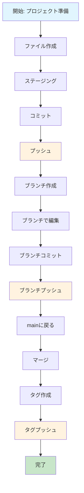

# 🎯 GitHub管理練習 - 視覚的整理

## 📊 練習フロー図



## 🌳 Git履歴の視覚化

```
main (HEAD) ──────────────────────────────────────────────┐
                                                         │
feature/github-practice ──────────────────────────────────┤
                                                         │
v1.0.0 (タグ) ───────────────────────────────────────────┤
                                                         │
276231a feat: ブランチ練習セクションを追加 ────────────────┤
                                                         │
be772eb feat: GitHub管理練習ガイドを追加 ─────────────────┤
                                                         │
8aad24c feat: GitHub管理のためのセットアップ ─────────────┤
                                                         │
4c612ba Merge pull request #4 ──────────────────────────┘
```

## 📈 学習進捗チャート

```
基本的なGitワークフロー
████████████████████ 100% [完了]

ブランチ操作
████████████████████ 100% [完了]

高度な操作
████████░░░░░░░░░░░░ 60% [進行中]

GitHub特有機能
░░░░░░░░░░░░░░░░░░░░ 0% [未開始]
```

## 🎯 操作タイムライン

```
時間軸: ──────────────────────────────────────────────────

[1] ファイル作成
    ↓
[2] ステージング
    ↓
[3] コミット
    ↓
[4] プッシュ
    ↓
[5] ブランチ作成
    ↓
[6] ブランチ編集
    ↓
[7] ブランチコミット
    ↓
[8] ブランチプッシュ
    ↓
[9] マージ
    ↓
[10] タグ作成
    ↓
[11] タグプッシュ
    ↓
[12] 完了
```

## 🔄 データフロー図

```
ローカル作業
┌─────────────────┐
│ ファイル編集    │
└─────────┬───────┘
          │
          ▼
┌─────────────────┐
│ git add         │ ← ステージング
└─────────┬───────┘
          │
          ▼
┌─────────────────┐
│ git commit      │ ← コミット
└─────────┬───────┘
          │
          ▼
┌─────────────────┐
│ git push        │ ← プッシュ
└─────────┬───────┘
          │
          ▼
┌─────────────────┐
│ GitHub          │ ← リモート同期
└─────────────────┘
```

## 📊 統計情報

### コミット統計
- **総コミット数**: 3個（練習中）
- **ファイル変更数**: 1ファイル
- **追加行数**: 42行
- **削除行数**: 0行

### プッシュ統計
- **初回プッシュ**: 328個のオブジェクト
- **練習プッシュ**: 3個のオブジェクト
- **ブランチプッシュ**: 3個のオブジェクト
- **タグプッシュ**: 1個のオブジェクト

### ブランチ情報
- **ローカルブランチ**: 2個
- **リモートブランチ**: 6個
- **作成したブランチ**: 1個
- **マージしたブランチ**: 1個

## 🎓 学習成果マップ

```
┌─────────────────────────────────────────────────────────┐
│                    GitHub管理練習                      │
├─────────────────────────────────────────────────────────┤
│  ✅ 基本操作  │  ✅ ブランチ  │  ✅ タグ  │  ⏳ 高度操作 │
│  ✅ コミット  │  ✅ マージ   │  ✅ プッシュ│  ⏳ リベース │
│  ✅ ステージング│  ✅ プル    │  ✅ フェッチ│  ⏳ スタッシュ│
└─────────────────────────────────────────────────────────┘
```

## 🚀 次のステップ

### 短期目標
1. **Pull Request作成** - GitHub Web UIでの操作
2. **Issue管理** - バグ報告・機能要求
3. **コードレビュー** - プルリクエストのレビュー

### 中期目標
1. **コンフリクト解決** - 意図的なコンフリクト作成
2. **リベース操作** - `git rebase` の習得
3. **スタッシュ操作** - `git stash` の習得

### 長期目標
1. **CI/CD連携** - GitHub Actionsの活用
2. **プロジェクト管理** - Projects機能の活用
3. **セキュリティ** - Security機能の活用

---

最終更新: 2025-01-28 15:45:00 JST
