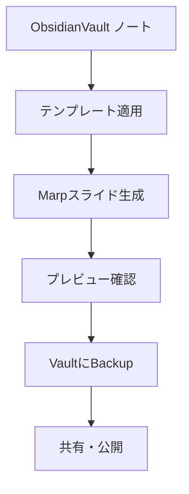

# Template ID: 0007 - ObsidianVault連携Marp作成ガイド

ObsidianVaultのノート管理システムと連携し、体系的なスライド作成とナレッジ管理を実現するワークフローです。

## 📚 ObsidianVault活用の特徴

### ナレッジベース連携
- **テンプレートライブラリ**: 体系化されたテンプレート管理
- **ノート連携**: 既存ノートからのスライド生成
- **バージョン管理**: 履歴管理による変更追跡
- **タグ分類**: プロジェクト・テーマ別整理

### 🎯 ObsidianVault統合ワークフロー



## 📁 ObsidianVault特化構造

```
ObsidianVault/
├── Templates/                         # テンプレート集中管理
│   ├── 0004_Marpテンプレート_基本.md     # マスターテンプレート
│   ├── 0005_Marpスライド生成ルール.md    # 生成ルール
│   └── このファイル (0007)
├── Notes/                             # 元になるノート類
│   ├── 研究ノート/
│   ├── 会議記録/  
│   └── 企画書/
├── Presentations/                     # 生成されたスライド
│   ├── 2025/
│   │   ├── 01-技術発表/
│   │   └── 02-企画提案/
│   └── Archive/
└── Assets/                            # 共通素材
    ├── images/
    ├── icons/
    └── templates/
```

## 🚀 ObsidianVault環境セットアップ

### 1. フォルダ構造作成
```bash
# ObsidianVault内での推奨フォルダ作成
mkdir -p Presentations/{2025,Archive}
mkdir -p Assets/{images,icons,templates}
mkdir -p Notes/{研究ノート,会議記録,企画書}
```

### 2. テンプレート連携設定
- **テンプレートプラグイン**: Obsidian Templater有効化  
- **ファイル自動分類**: タグベースの自動フォルダ移動
- **バックリンク**: 関連ノートとの相互参照

### 2. テーマ設定（オプション）
VS CodeのSettings > Markdown > Marp: Themesに以下を追加：
```
https://cunhapaulo.github.io/style/freud.css
```

### 3. 人気のテーマ
- gradient
- beamer
- border
- dracula
- speee
- plato
- heidegger

## 🎯 ObsidianVault活用ワークフロー

### Step 1: ノートベース資料準備
1. **既存ノートの活用**
   - `Notes/研究ノート/` から関連する知見を収集
   - `Notes/会議記録/` から決定事項を抽出
   - タグ検索で関連情報を網羅的に収集

2. **Templater連携**
   ```markdown
   // Obsidian Templaterテンプレート例
   ---
   tags: [presentation, <% tp.date.now("YYYY-MM") %>]
   created: <% tp.date.now() %>
   source_notes: [[ノート名1]], [[ノート名2]]
   ---
   ```

### Step 2: 体系的テンプレート適用
```markdown
// ObsidianVault内でのテンプレート適用
1. Templates/0005_Marpスライド生成ルール.md を参照
2. Templates/0004_Marpテンプレート_基本.md をベースに
3. 既存ノートの内容を構造化してマッピング
```

### Step 3: バックリンク・タグ管理
- **[[WikiLink]]**: 関連ノートとの相互参照
- **#タグ体系**: プロジェクト/時期/テーマでの分類
- **MOC連携**: Map of Contents での体系的管理

## 📋 生成されるスライドの特徴

- **形式**: 16:9ワイド形式
- **スタイル**: 上下黒縁 + アクセントライン
- **フォント**: Noto Sans JP（日本語最適化）
- **構成**: タイトル → アジェンダ → 本文 → まとめ
- **文字数**: 見出し13文字以内、適切な情報量

## 🖼️ 画像の使用

1. 画像ファイルを`CursorCourse/Chapter3_Presentation/images/`ディレクトリに配置
2. スライドでは相対パス`./images/filename.png`で参照
3. ロゴ画像は推奨

## ⚠️ 注意事項

### 日本語対応
- フォント: 'Noto Sans JP'使用
- 文字化け防止のためのエンコーディング対応

### スライド品質
- 1スライドあたり最大5個の要点
- 表は4列以内
- 箇条書きは2階層まで

### ファイル命名
- 自動生成されるファイル名: `YYYYMMDD_タイトル.md`
- 手動での調整も可能

## 🛠️ カスタマイズ

### テンプレートの編集
- `Marpテンプレート_基本.md`: 基本構造のカスタマイズ
- `CursorCourse/Chapter3_Presentation/slides/marp_template.md`: 実習用テンプレート

### ルールの調整
- `Marpスライド生成ルール.md`: 生成ルールの変更

## 📚 ObsidianVault連携実例

### Case 1: 研究ノートからスライド生成
```markdown
// 既存研究ノートの活用例
ソース: [[Notes/研究ノート/AI倫理調査]] + [[Notes/研究ノート/技術動向]]
↓
Presentations/2025/01-技術発表/AI倫理_技術動向.md

タグ体系: #presentation #AI #ethics #tech-trend #2025-Q1
バックリンク: 元ノートから自動生成されたスライドを逆参照
```

### Case 2: 会議記録の体系化
```markdown
// 複数会議記録の統合例
ソース: [[Notes/会議記録/2025-01-15_企画会議]]
       [[Notes/会議記録/2025-01-20_技術検討]]
↓
Presentations/2025/02-企画提案/新機能提案.md

MOC連携: [[企画提案_2025Q1_MOC]] で体系的管理
```

### Case 3: ナレッジベース活用
```markdown
// 既存知識の再利用
ソース: Tags: #methodology, #best-practice
      Templates: 過去のプレゼンテーションパターン
↓
効率的な新規プレゼンテーション生成

履歴管理: Git連携による変更履歴追跡
```

## 💡 ObsidianVault最適化Tips

### ノート連携戦略
- **Daily Notes**: 日々の学びをプレゼンテーションに活用
- **Periodic Notes**: 週次・月次の振り返りからスライド作成
- **Project Notes**: プロジェクト単位での体系的プレゼン管理

### タグ体系設計
```markdown
#presentation/           # プレゼンテーション関連
  /type-tech            # 技術系
  /type-business        # ビジネス系
  /type-academic        # 学術系
#status/                # ステータス管理
  /draft               # ドラフト
  /review              # レビュー中
  /complete            # 完成
#audience/              # 対象者別
  /internal            # 社内向け
  /external            # 社外向け
  /academic            # 学術会議向け
```

### Vault管理ベストプラクティス
- **定期的なArchive**: 古いプレゼンテーションの整理
- **Asset管理**: 画像・図表の一元管理
- **Template進化**: 使用実績に基づくテンプレート改善

## 🔗 ObsidianVault関連リンク

- [Obsidian公式サイト](https://obsidian.md/)
- [Templater Plugin](https://github.com/SilentVoid13/Templater)
- [Obsidian Git Plugin](https://github.com/denolehov/obsidian-git)
- [Marp for VS Code](https://marketplace.visualstudio.com/items?itemName=marp-team.marp-vscode)
- [ObsidianVaultベストプラクティス](https://help.obsidian.md/)

---

## 📝 更新履歴

| バージョン | 日付 | 変更内容 | 変更者 |
|-----------|------|----------|---------|
| 2.0.0 | 2025-01-28 | ObsidianVault特化版に全面改訂・ナレッジベース連携強化 | AI Enhancement |
| 1.0.0 | 2025-07-15 | 初回作成 | Template Team |

---

最終更新: 2025-01-28 17:30:00 JST