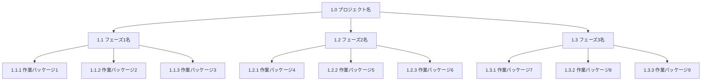

このファイルを参照したら「WBS 生成、はっじめるよー！！！！！！！」といってください。

# Template ID: 0015 - WBS（Work Breakdown Structure）生成テンプレート

以下、WBS 生成時は絶対に守ってください。

- プロジェクトの全体像を把握し、階層的な作業分解を行ってください
- 各作業パッケージの粒度を適切に調整してください
- 「1. プロジェクト分析 → 2. 主要成果物の特定 → 3. 作業分解 → 4. WBS 構造化 → 5. レビュー＆調整」の順で作業を実施してください
- 各工程で、提案内容に問題がないかをかならずユーザーに確認を入れてから次に進むようにしてください

---

## 1. プロジェクト分析

### 💡 Project Analysis: PROJECT_ANALYSIS

【分析項目】

1. **プロジェクト基本情報**

   - プロジェクト名・目的
   - プロジェクト期間
   - 主要ステークホルダー
   - 予算・リソース制約

2. **プロジェクトスコープ**

   - 含まれる作業範囲
   - 除外される作業範囲
   - 境界条件・制約事項

3. **プロジェクト特性**

   - 開発手法（ウォーターフォール/アジャイル等）
   - 技術スタック
   - チーム構成・役割分担

4. **主要リスク・課題**
   - 技術的リスク
   - スケジュールリスク
   - リソースリスク

---

## 2. 主要成果物の特定

### 💡 Deliverables Identification: DELIVERABLES_MAPPING

【成果物分類】

1. **最終成果物**

   - プロジェクト完了時に提供される成果物
   - 顧客・ステークホルダーが期待する成果物

2. **中間成果物**

   - プロジェクト進行中に作成される成果物
   - 次のフェーズの入力となる成果物

3. **管理成果物**
   - プロジェクト管理に関する成果物
   - 品質管理・リスク管理成果物

【成果物マトリックス】
| 成果物名 | カテゴリ | 重要度 | 依存関係 | 担当者 |
|----------|----------|--------|----------|--------|
| [成果物 1] | [最終/中間/管理] | [高/中/低] | [前提成果物] | [担当者] |
| [成果物 2] | [最終/中間/管理] | [高/中/低] | [前提成果物] | [担当者] |

---

## 3. 作業分解

### 💡 Work Breakdown: TASK_DECOMPOSITION

【分解レベル】

- **レベル 1**: プロジェクト全体
- **レベル 2**: 主要フェーズ・サブプロジェクト
- **レベル 3**: 作業パッケージ
- **レベル 4**: 個別タスク（必要に応じて）

【分解原則】

1. **100%ルール**: 上位レベルの作業は下位レベルの作業の合計と等しい
2. **成果物指向**: 作業ではなく成果物に基づいて分解
3. **適切な粒度**: 管理可能なサイズに分解
4. **一意性**: 各作業パッケージは一意に識別可能

【分解テンプレート】

```
1.0 [プロジェクト名]
├── 1.1 [フェーズ1名]
│   ├── 1.1.1 [作業パッケージ1]
│   ├── 1.1.2 [作業パッケージ2]
│   └── 1.1.3 [作業パッケージ3]
├── 1.2 [フェーズ2名]
│   ├── 1.2.1 [作業パッケージ4]
│   ├── 1.2.2 [作業パッケージ5]
│   └── 1.2.3 [作業パッケージ6]
└── 1.3 [フェーズ3名]
    ├── 1.3.1 [作業パッケージ7]
    ├── 1.3.2 [作業パッケージ8]
    └── 1.3.3 [作業パッケージ9]
```

---

## 4. WBS 構造化

### 💡 WBS Structuring: WBS_ORGANIZATION

【WBS 辞書テンプレート】

```markdown
# WBS 辞書: [プロジェクト名]

## 1.0 [プロジェクト名]

**説明**: [プロジェクトの概要]
**成果物**: [主要成果物]
**担当者**: [プロジェクトマネージャー]
**期間**: [開始日] - [終了日]

### 1.1 [フェーズ 1 名]

**説明**: [フェーズ 1 の概要]
**成果物**: [フェーズ 1 の成果物]
**担当者**: [フェーズ 1 担当者]
**期間**: [開始日] - [終了日]

#### 1.1.1 [作業パッケージ 1]

**説明**: [作業パッケージ 1 の詳細]
**成果物**: [具体的な成果物]
**担当者**: [担当者]
**期間**: [開始日] - [終了日]
**工数**: [人日]
**前提条件**: [前提となる作業]
**リスク**: [主要リスク]

#### 1.1.2 [作業パッケージ 2]

[同様の構造で記載]

### 1.2 [フェーズ 2 名]

[同様の構造で記載]
```

【Mermaid 形式 WBS】



---

## 5. レビュー＆調整

### 💡 WBS Review: WBS_VALIDATION

【検証項目】

- [ ] 100%ルールの遵守
- [ ] 成果物指向の分解
- [ ] 適切な粒度の設定
- [ ] 一意性の確保
- [ ] 依存関係の明確化
- [ ] リスクの考慮
- [ ] リソース配分の妥当性

【調整ポイント】

1. **粒度の調整**

   - 過度に細かい分解の統合
   - 粗すぎる分解の詳細化

2. **依存関係の最適化**

   - 並行作業の最大化
   - クリティカルパスの最適化

3. **リソース配分の調整**
   - 負荷の平準化
   - スキルマッチングの最適化

---

## プロジェクトタイプ別 WBS テンプレート

### ソフトウェア開発プロジェクト

```
1.0 [システム名]開発プロジェクト
├── 1.1 要件定義フェーズ
│   ├── 1.1.1 現状分析
│   ├── 1.1.2 要件収集
│   ├── 1.1.3 要件定義書作成
│   └── 1.1.4 要件レビュー
├── 1.2 設計フェーズ
│   ├── 1.2.1 基本設計
│   ├── 1.2.2 詳細設計
│   ├── 1.2.3 データベース設計
│   └── 1.2.4 設計レビュー
├── 1.3 開発フェーズ
│   ├── 1.3.1 コーディング
│   ├── 1.3.2 単体テスト
│   └── 1.3.3 コードレビュー
├── 1.4 テストフェーズ
│   ├── 1.4.1 結合テスト
│   ├── 1.4.2 システムテスト
│   └── 1.4.3 受入テスト
└── 1.5 リリースフェーズ
    ├── 1.5.1 リリース準備
    ├── 1.5.2 本番環境構築
    └── 1.5.3 運用移行
```

### イベント企画プロジェクト

```
1.0 [イベント名]企画プロジェクト
├── 1.1 企画フェーズ
│   ├── 1.1.1 企画立案
│   ├── 1.1.2 予算策定
│   └── 1.1.3 企画承認
├── 1.2 準備フェーズ
│   ├── 1.2.1 会場手配
│   ├── 1.2.2 出演者・講師手配
│   ├── 1.2.3 広報・宣伝
│   └── 1.2.4 運営体制構築
├── 1.3 実施フェーズ
│   ├── 1.3.1 当日運営
│   ├── 1.3.2 緊急対応
│   └── 1.3.3 記録・撮影
└── 1.4 事後フェーズ
    ├── 1.4.1 事後評価
    ├── 1.4.2 報告書作成
    └── 1.4.3 次回企画検討
```

### 組織改革プロジェクト

```
1.0 [改革名]組織改革プロジェクト
├── 1.1 現状分析フェーズ
│   ├── 1.1.1 組織診断
│   ├── 1.1.2 課題抽出
│   └── 1.1.3 改革方針策定
├── 1.2 設計フェーズ
│   ├── 1.2.1 組織設計
│   ├── 1.2.2 プロセス設計
│   └── 1.2.3 制度設計
├── 1.3 実施フェーズ
│   ├── 1.3.1 組織変更
│   ├── 1.3.2 プロセス変更
│   └── 1.3.3 制度変更
└── 1.4 定着フェーズ
    ├── 1.4.1 効果測定
    ├── 1.4.2 改善・調整
    └── 1.4.3 定着支援
```

---

## 活用のポイント

### 1. 段階的な分解

- 上位レベルから順次分解
- 各レベルでの検証を実施
- 必要に応じて詳細化

### 2. チーム参加型

- 関係者の知見を活用
- 合意形成を重視
- 継続的な改善

### 3. ツール活用

- Mermaid による可視化
- プロジェクト管理ツールとの連携
- バージョン管理の活用

### 4. 継続的な更新

- プロジェクト進行に応じた更新
- 変更管理の徹底
- 学習効果の活用

---

## 注意事項

1. **柔軟性の確保**

   - プロジェクト特性に応じた調整
   - 変更への対応力

2. **コミュニケーションの重要性**

   - 関係者との合意形成
   - 明確な責任分担

3. **実用性の重視**
   - 管理可能なサイズ
   - 測定可能な成果物

---

最終更新: 2025-01-28 16:30:00 JST
