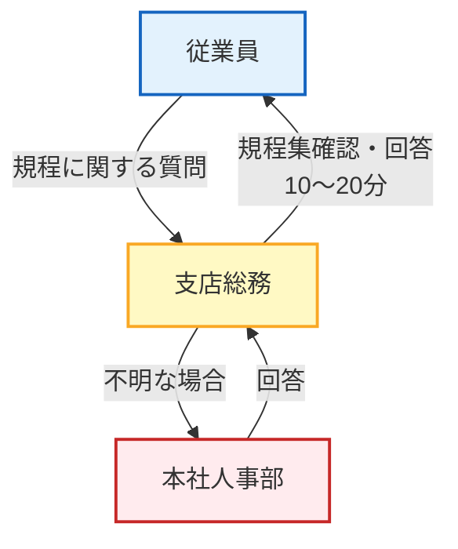
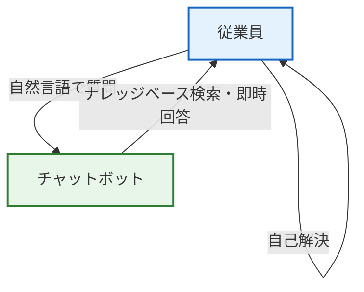
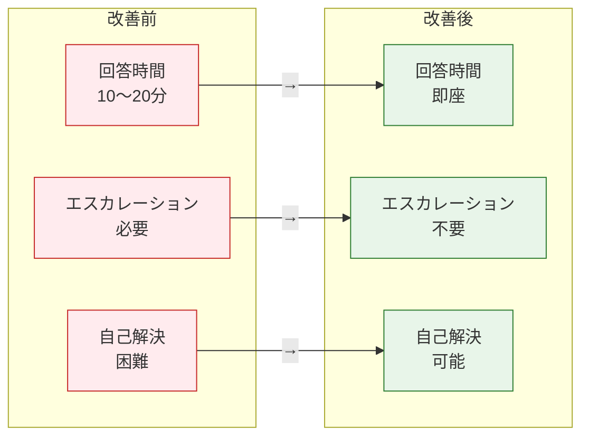
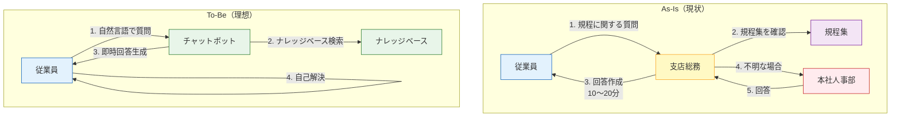
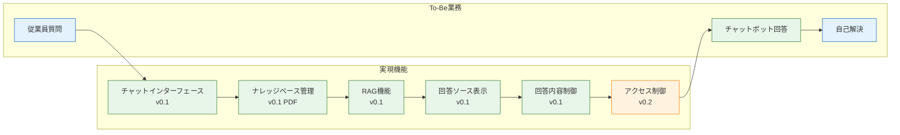

# 業務フロー比較図（As-Is vs To-Be）

## As-Is（現状の業務）

```mermaid
flowchart TD
    A[従業員] -->|規程に関する質問| B[支店総務]
    B -->|規程集確認・回答<br/>10～20分| A
    B -->|不明な場合| C[本社人事部]
    C -->|回答| B

    style A fill:#E3F2FD,stroke:#1565C0,stroke-width:2px
    style B fill:#FFF9C4,stroke:#F9A825,stroke-width:2px
    style C fill:#FFEBEE,stroke:#C62828,stroke-width:2px
```

## To-Be（あるべき姿の業務）

```mermaid
flowchart TD
    A[従業員] -->|自然言語で質問| B[チャットボット]
    B -->|ナレッジベース検索・即時回答| A
    A -->|自己解決| A

    style A fill:#E3F2FD,stroke:#1565C0,stroke-width:2px
    style B fill:#E8F5E9,stroke:#2E7D32,stroke-width:2px
```

## 業務効率化の効果

```mermaid
graph LR
    subgraph "改善前"
        A1[回答時間<br/>10～20分]
        A2[エスカレーション<br/>必要]
        A3[自己解決<br/>困難]
    end

    subgraph "改善後"
        B1[回答時間<br/>即座]
        B2[エスカレーション<br/>不要]
        B3[自己解決<br/>可能]
    end

    A1 -->|→| B1
    A2 -->|→| B2
    A3 -->|→| B3

    style A1 fill:#FFEBEE,stroke:#C62828
    style A2 fill:#FFEBEE,stroke:#C62828
    style A3 fill:#FFEBEE,stroke:#C62828
    style B1 fill:#E8F5E9,stroke:#2E7D32
    style B2 fill:#E8F5E9,stroke:#2E7D32
    style B3 fill:#E8F5E9,stroke:#2E7D32
```

## 詳細業務フロー比較

```mermaid
flowchart TB
    subgraph "As-Is（現状）"
        A1[従業員] -->|1. 規程に関する質問| B1[支店総務]
        B1 -->|2. 規程集を確認| C1[規程集]
        B1 -->|3. 回答作成<br/>10～20分| A1
        B1 -->|4. 不明な場合| D1[本社人事部]
        D1 -->|5. 回答| B1
    end

    subgraph "To-Be（理想）"
        A2[従業員] -->|1. 自然言語で質問| B2[チャットボット]
        B2 -->|2. ナレッジベース検索| C2[ナレッジベース]
        B2 -->|3. 即時回答生成| A2
        A2 -->|4. 自己解決| A2
    end

    style A1 fill:#E3F2FD,stroke:#1565C0
    style B1 fill:#FFF9C4,stroke:#F9A825
    style C1 fill:#F3E5F5,stroke:#7B1FA2
    style D1 fill:#FFEBEE,stroke:#C62828
    style A2 fill:#E3F2FD,stroke:#1565C0
    style B2 fill:#E8F5E9,stroke:#2E7D32
    style C2 fill:#E8F5E9,stroke:#2E7D32
```

## 機能要件との対応

```mermaid
flowchart LR
    subgraph "実現機能"
        A[チャットインターフェース<br/>v0.1]
        B[ナレッジベース管理<br/>v0.1 PDF]
        C[RAG機能<br/>v0.1]
        D[回答ソース表示<br/>v0.1]
        E[回答内容制御<br/>v0.1]
        F[アクセス制御<br/>v0.2]
    end

    subgraph "To-Be業務"
        G[従業員質問]
        H[チャットボット回答]
        I[自己解決]
    end

    G --> A
    A --> B
    B --> C
    C --> D
    D --> E
    E --> F
    F --> H
    H --> I

    style A fill:#E8F5E9,stroke:#2E7D32
    style B fill:#E8F5E9,stroke:#2E7D32
    style C fill:#E8F5E9,stroke:#2E7D32
    style D fill:#E8F5E9,stroke:#2E7D32
    style E fill:#E8F5E9,stroke:#2E7D32
    style F fill:#FFF3E0,stroke:#F57C00
    style G fill:#E3F2FD,stroke:#1565C0
    style H fill:#E8F5E9,stroke:#2E7D32
    style I fill:#E3F2FD,stroke:#1565C0
```

---

最終更新: 2025-08-06 10:15:00 JST
