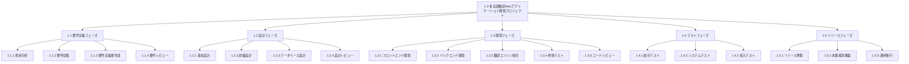

# WBS サンプル: 翻訳アプリ開発プロジェクト

## プロジェクト概要

- **プロジェクト名**: 多言語翻訳 Web アプリケーション開発
- **期間**: 2025 年 2 月 1 日 - 2025 年 6 月 30 日（5 ヶ月）
- **予算**: 1,500 万円
- **チーム規模**: 8 名（PM 1 名、開発者 5 名、テスト担当 1 名、UI/UX 担当 1 名）

## WBS 構造

### 1.0 多言語翻訳 Web アプリケーション開発プロジェクト

#### 1.1 要件定義フェーズ（2 週間）

- **1.1.1 現状分析**

  - 説明: 既存システムの分析、競合調査
  - 成果物: 現状分析レポート
  - 担当者: PM、システムアナリスト
  - 期間: 2025-02-01 - 2025-02-07
  - 工数: 10 人日

- **1.1.2 要件収集**

  - 説明: ステークホルダーインタビュー、ユーザー調査
  - 成果物: 要件収集レポート
  - 担当者: PM、システムアナリスト
  - 期間: 2025-02-03 - 2025-02-10
  - 工数: 12 人日

- **1.1.3 要件定義書作成**

  - 説明: 機能要件・非機能要件の整理
  - 成果物: 要件定義書
  - 担当者: システムアナリスト
  - 期間: 2025-02-10 - 2025-02-14
  - 工数: 8 人日

- **1.1.4 要件レビュー**
  - 説明: ステークホルダーによる要件確認
  - 成果物: 承認済み要件定義書
  - 担当者: PM、全ステークホルダー
  - 期間: 2025-02-14 - 2025-02-15
  - 工数: 4 人日

#### 1.2 設計フェーズ（3 週間）

- **1.2.1 基本設計**

  - 説明: システム全体の設計、アーキテクチャ決定
  - 成果物: 基本設計書
  - 担当者: システムアーキテクト
  - 期間: 2025-02-17 - 2025-02-28
  - 工数: 15 人日

- **1.2.2 詳細設計**

  - 説明: 各機能の詳細設計
  - 成果物: 詳細設計書
  - 担当者: シニア開発者
  - 期間: 2025-02-24 - 2025-03-07
  - 工数: 20 人日

- **1.2.3 データベース設計**

  - 説明: DB スキーマ設計、データモデル作成
  - 成果物: データベース設計書
  - 担当者: DB 設計者
  - 期間: 2025-02-28 - 2025-03-07
  - 工数: 10 人日

- **1.2.4 設計レビュー**
  - 説明: 設計内容の技術レビュー
  - 成果物: レビュー結果レポート
  - 担当者: 技術リーダー
  - 期間: 2025-03-07 - 2025-03-10
  - 工数: 6 人日

#### 1.3 開発フェーズ（8 週間）

- **1.3.1 フロントエンド開発**

  - 説明: React/Next.js による UI 開発
  - 成果物: フロントエンドアプリケーション
  - 担当者: フロントエンド開発者 2 名
  - 期間: 2025-03-10 - 2025-04-25
  - 工数: 60 人日

- **1.3.2 バックエンド開発**

  - 説明: API 開発、ビジネスロジック実装
  - 成果物: バックエンド API
  - 担当者: バックエンド開発者 2 名
  - 期間: 2025-03-10 - 2025-04-25
  - 工数: 60 人日

- **1.3.3 翻訳エンジン統合**

  - 説明: 外部翻訳 API との連携
  - 成果物: 翻訳機能
  - 担当者: シニア開発者
  - 期間: 2025-03-17 - 2025-04-18
  - 工数: 25 人日

- **1.3.4 単体テスト**

  - 説明: 各機能の単体テスト実装
  - 成果物: 単体テストコード
  - 担当者: 開発者全員
  - 期間: 2025-03-24 - 2025-04-25
  - 工数: 40 人日

- **1.3.5 コードレビュー**
  - 説明: コード品質の確認
  - 成果物: レビュー結果
  - 担当者: 技術リーダー
  - 期間: 2025-04-21 - 2025-04-25
  - 工数: 10 人日

#### 1.4 テストフェーズ（3 週間）

- **1.4.1 結合テスト**

  - 説明: システム全体の結合テスト
  - 成果物: 結合テスト結果レポート
  - 担当者: テスト担当者
  - 期間: 2025-04-28 - 2025-05-09
  - 工数: 20 人日

- **1.4.2 システムテスト**

  - 説明: 全機能のシステムテスト
  - 成果物: システムテスト結果レポート
  - 担当者: テスト担当者
  - 期間: 2025-05-12 - 2025-05-23
  - 工数: 25 人日

- **1.4.3 受入テスト**
  - 説明: 顧客による受入テスト
  - 成果物: 受入テスト結果
  - 担当者: 顧客、PM
  - 期間: 2025-05-26 - 2025-05-30
  - 工数: 15 人日

#### 1.5 リリースフェーズ（2 週間）

- **1.5.1 リリース準備**

  - 説明: 本番環境の準備、ドキュメント整備
  - 成果物: リリースパッケージ
  - 担当者: 運用担当者
  - 期間: 2025-06-02 - 2025-06-06
  - 工数: 10 人日

- **1.5.2 本番環境構築**

  - 説明: 本番サーバーの構築・設定
  - 成果物: 本番環境
  - 担当者: インフラ担当者
  - 期間: 2025-06-09 - 2025-06-13
  - 工数: 8 人日

- **1.5.3 運用移行**
  - 説明: 本番環境への移行・初期運用
  - 成果物: 運用開始
  - 担当者: 運用担当者、PM
  - 期間: 2025-06-16 - 2025-06-20
  - 工数: 10 人日

## Mermaid 形式 WBS

## 工数サマリー

| フェーズ | 工数（人日） | 期間        | 担当者数 |
| -------- | ------------ | ----------- | -------- |
| 要件定義 | 34           | 2 週間      | 2 名     |
| 設計     | 51           | 3 週間      | 3 名     |
| 開発     | 195          | 8 週間      | 5 名     |
| テスト   | 60           | 3 週間      | 2 名     |
| リリース | 28           | 2 週間      | 3 名     |
| **合計** | **368**      | **18 週間** | **8 名** |

## 主要マイルストーン

| マイルストーン | 予定日     | 成果物             |
| -------------- | ---------- | ------------------ |
| 要件定義完了   | 2025-02-15 | 承認済み要件定義書 |
| 設計完了       | 2025-03-10 | 設計書一式         |
| 開発完了       | 2025-04-25 | アプリケーション   |
| テスト完了     | 2025-05-30 | テスト結果レポート |
| リリース       | 2025-06-20 | 本番運用開始       |

---

最終更新: 2025-01-28 16:35:00 JST
